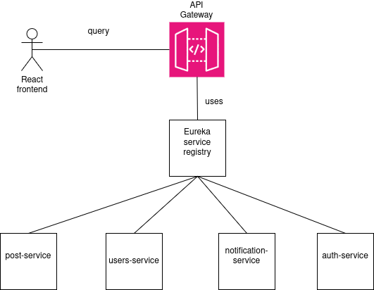

<h1 style="text-align: center">Architecture</h1>
    

Microservices are build using REST API architecture using Spring Web project. Communication between them is
synchronous using HTTP protocol  and asynchronous using Kafka as message broker.
For data persistence and manipulation is used Spring Data project.
There is API Gateway which function as main entry point. There is service discovery mechanism 
 which Gateway uses in order to route request to the correct microservice. For authnetication
and authorization Spring Security 6 is used with JWT.

