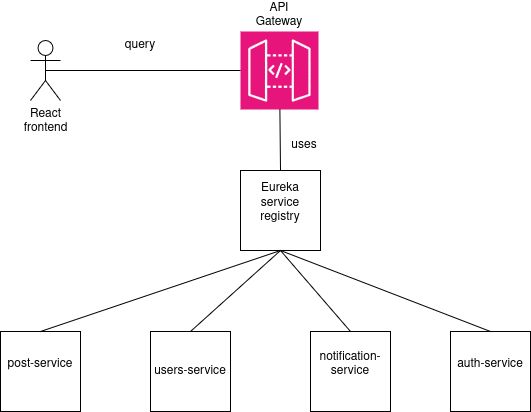

<h1 style="text-align: center">Architecture</h1>
    

Microservices are build using REST API architecture using Spring Web project. Communication between them is
synchronous using HTTP protocol  and asynchronous using Kafka as message broker.
For data persistence and manipulation is used Spring Data project.
There is API Gateway which function as main entry point. There is service discovery mechanism 
 which Gateway uses in order to route request to the correct microservice. For authnetication
and authorization Spring Security 6 is used with JWT.

## Transactional Outbox (post-service)

Direct Kafka publishes inside a transaction aren't atomic — a crash after the DB commit but before **kafkaTemplate.send()** drops the event silently.

Instead **PostService** writes an **OutboxEvent** row to **outbox_events** in the same transaction as the post update. **OutboxEventPoller** uses Spring Boot scheduling to pick up unpublished rows every 5 seconds, sends them to Kafka and marks them published.

See [ADR 003](decisions/003-transactional-outbox.md) for the decision rationale, drawbacks and alternatives.