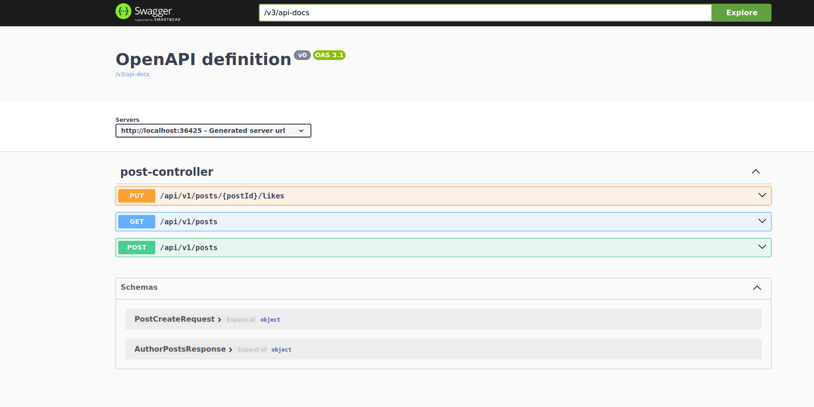

<h1 style="text-align: center">Post service Api documentation</h1>
<h2>Overview</h2>

API is implemented using Spring Web project following REST architecture.
URI api versioning is used where endpoints are prefixed with <b>/api/[version]</b> e.g /api/v1.
All endpoints except /login and /register require user to be authenticated.  This is achieved using JWT tokens and for their issuance, validation etc. is responsible auth microservice.  

