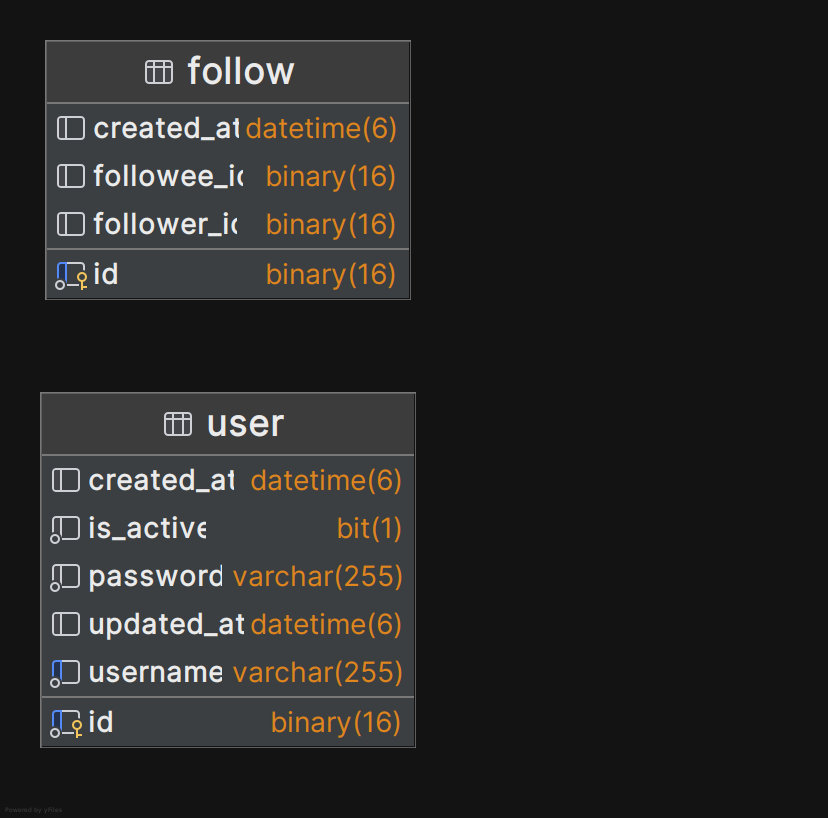

<h1 style="text-align: center">User microservice</h1>

<h2>Overview</h2>

This microservice uses PostgreSQL RDBMS for persisting information for users and who they follow.
Spring Data JPA with Hibernate ORM is used for interaction with the database.
Redis NoSQL datastore is used for caching the information about users and who they follow.

<h3>Entity Relationship Diagram</h3>
