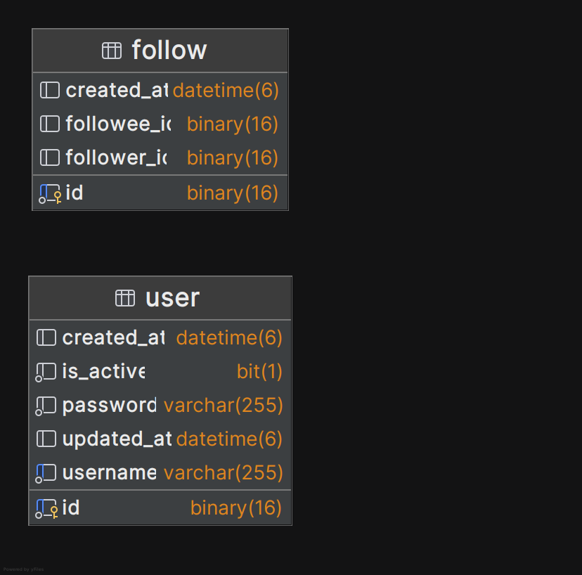

# User microservice — database

## Overview

This microservice uses **MySQL** for persisting users and follow relationships. Spring Data JPA with Hibernate ORM is used for database interaction.

## Entity Relationship Diagram

